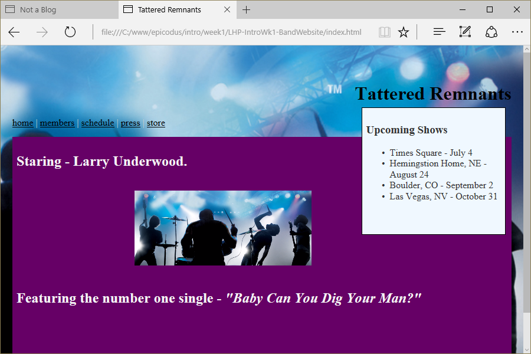

# Tattered Remants (Fictional Band Website)
Version 0.0.1: March 23, 2016
by [Karen Freeman-Smith](https://karenfreemansmith.github.io)

### Technologies Used
HTML, CSS, Git, Github

## Description
[Learn How to Program](http://learnhowtoprogram.com) Intro to Programming Week 1 Independent Project: Create a band website to practice CSS box model and floats (without Bootstrap). This band was borrowed from Stephen King's, 'The Stand'.

## Setup/Installation
* [View on Github Pages](https://karenfreemansmith.github.io/LHP-IntroWk1-BlogDesign)

 __OR__
* Clone project to your computer
* Open index.html in your favorite browser

## Support & Contact
For questions, concerns, or suggestions please email karenfreemansmith@gmail.com

## Known Issues
* None

## Legal
* Licensed under the GNU General Public License v3.0

Copyright (c) 2016 Copyright _[Karen Freeman-Smith](https://karenfreemansmith.github.io)_ All Rights Reserved.
